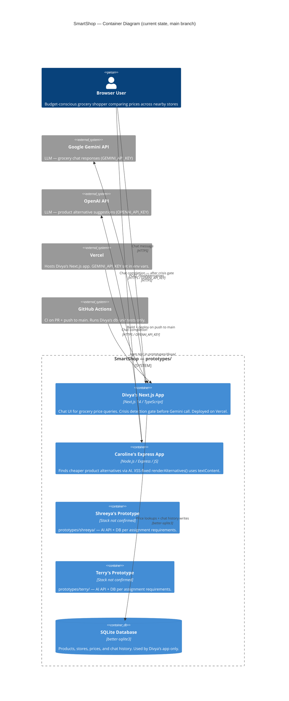

# Architecture Retrospective — SmartShop

**Repo:** https://github.com/CSEN-SCU/csen-174-s26-team-project-smartshop
**Date:** May 19, 2026
**Team:** Divya Bengali, Shreeya Koritala, Caroline Tapia, Terry Chen

---

## C4 Container Diagram

---

## External Services & Call Sites

| Service | Key / Auth | Call site |
|---------|-----------|-----------|
| Google Gemini API | `GEMINI_API_KEY` | `prototypes/divya/src/app/api/chat/route.ts` |
| OpenAI API | `OPENAI_API_KEY` | `prototypes/Caroline/app.js` — `renderAlternatives()` |
| SQLite (better-sqlite3) | local file | `prototypes/divya/src/lib/db.ts` |
| Vercel | env var `GEMINI_API_KEY` | `csen-174-s26-team-project-smartshop.vercel.app` |
| GitHub Actions | `GEMINI_API_KEY` secret | `.github/workflows/ci.yml` |

> **Note:** Shreeya and Terry's prototypes are in `prototypes/shreeya/` and `prototypes/terry/` respectively. Their AI API integrations and databases are confirmed present per assignment requirements but were not read during this audit pass.

---

## Security Notes (Week 7 Audit)

Two findings were fixed and merged to main:

- **PR #28** — Added a crisis/sensitive-content detection gate in `prototypes/divya/src/app/api/chat/route.ts` before the Gemini call. Inputs matching self-harm or minor-disclosure patterns return a 988 Lifeline response instead of forwarding to the model.
- **PR #29** — Fixed XSS in `prototypes/Caroline/app.js`. `renderAlternatives()` was using `innerHTML` to render AI-generated content; replaced with `textContent` to prevent script injection.

See `docs/sprint-2-remediations.md` for full before/after diffs.

---

## CI Coverage Gap

GitHub Actions currently only runs tests in `prototypes/divya/`. Caroline's, Shreeya's, and Terry's prototypes have no CI test coverage. `OPENAI_API_KEY` is not in the repo secrets, so a Caroline-covering workflow would need it added.
