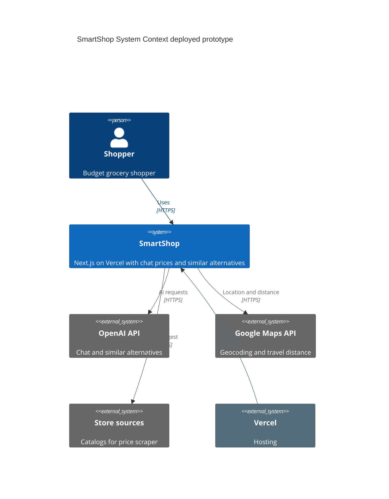

# Architecture Retrospective — SmartShop

**Date:** May 19, 2026  
**Team:** Divya Bengali, Shreeya Koritala, Caroline Tapia, Terry Chen

---
## Product Vision
#### FOR 
grocery shoppers
#### WHO 
want to save money/are on a budget.
#### THE 
Smart Shop app
#### THAT
Compares prices of groceries across different stores in the area and shows the user the most affordable option
#### UNLIKE 
Honey, the browser extension, that looks for online coupons. And unlike manually checking each store’s app/website (or just shopping at one store and hoping it’s cheapest).
#### OUR PRODUCT 
shows both prices and distance to the grocery store and helps users decide whether a lower price is actually worth the extra trip. Smart Shop automatically finds the lowest local price for the exact item you want across multiple stores so you don’t overpay for the same thing. Our product is POWERED BY AI that will read the text that the user inputs into the app and searches the database to search for the most affordable options. A scraper gathers information on products and pricing which is then stored in the database. It reduces the manual work of searching store by store and helps users compare equivalent products more accurately.

## W4 Diagrams

[Context Diagram](https://github.com/CSEN-SCU/csen-174-s26-team-project-smartshop/blob/main/docs/c4-context-diagram.md)

[Container Diagram](https://github.com/CSEN-SCU/csen-174-s26-team-project-smartshop/blob/main/docs/c4-container-diagram.md)

We had originanlly planned to have a multi page app where the user can enter a list of items they want. Then, an api call would be made to OpenAI which would normalize the list and output the stores to find the lowest prices. This would also make a call to Google Maps API for store name and location. We planned to have a database with items and prices.

## Current C4 System Context Diagram

```mermaid
C4Context
  title SmartShop System Context deployed prototype

  Person(shopper, "Shopper", "Budget grocery shopper")

  System(smartshop, "SmartShop", "Next.js on Vercel with chat prices and similar alternatives")

  System_Ext(openai, "OpenAI API", "Chat and similar alternatives")
  System_Ext(maps, "Google Maps API", "Geocoding and travel distance")
  System_Ext(retailers, "Store sources", "Catalogs for price scraper")
  System_Ext(vercel, "Vercel", "Hosting")

  Rel(shopper, smartshop, "Uses", "HTTPS")
  Rel(smartshop, openai, "AI requests", "HTTPS")
  Rel(smartshop, maps, "Location and distance", "HTTPS")
  Rel(smartshop, retailers, "Price ingest", "HTTPS")
  Rel(vercel, smartshop, "Deploys", "HTTPS")

  UpdateElementStyle(shopper, $bgColor="#08427B", $fontColor="#FFFFFF", $borderColor="#052E56")
  UpdateElementStyle(smartshop, $bgColor="#1168BD", $fontColor="#FFFFFF", $borderColor="#0B4884")
  UpdateElementStyle(openai, $bgColor="#686868", $fontColor="#FFFFFF", $borderColor="#444444")
  UpdateElementStyle(maps, $bgColor="#686868", $fontColor="#FFFFFF", $borderColor="#444444")
  UpdateElementStyle(retailers, $bgColor="#686868", $fontColor="#FFFFFF", $borderColor="#444444")
  UpdateElementStyle(vercel, $bgColor="#546E7A", $fontColor="#FFFFFF", $borderColor="#37474F")
  UpdateRelStyle(shopper, smartshop, $lineColor="#08427B", $textColor="#08427B")
  UpdateRelStyle(smartshop, openai, $lineColor="#686868", $textColor="#686868")
  UpdateRelStyle(smartshop, maps, $lineColor="#686868", $textColor="#686868")
  UpdateRelStyle(smartshop, retailers, $lineColor="#686868", $textColor="#686868")
  UpdateRelStyle(vercel, smartshop, $lineColor="#546E7A", $textColor="#546E7A")
  UpdateLayoutConfig($c4ShapeInRow="3", $c4BoundaryInRow="1")
```

Colors align with the [container diagram PDF](./architecture-retrospective.pdf) legend: **Person** (navy), **verified container** (blue), **external service** (gray), **infrastructure** (slate).

## Current C4 Container Diagram

[View architecture-retrospective.pdf](https://github.com/CSEN-SCU/csen-174-s26-team-project-smartshop/blob/main/docs/architecture-retrospective.pdf)

---

## Decisions That Shifted

Three architectural calls changed materially between the Week 4 design and the Week 7 deployed prototype.

**1. Fragmented prototypes → one deployed surface**

*Context:* The assignment structure required each team member to own an independent subdirectory under `prototypes/`. No shared router or monorepo build was ever established, so the four codebases never converged.

*Decision:* Ship Divya's Next.js app as the sole deployed endpoint (Vercel). Caroline's Express alternative-finder, Shreeya's prototype, and Terry's prototype remain local-only.

*Consequences:* No single URL surfaces all four features. A user who wants price chat AND product alternatives must run two local servers. Three teammates' work is invisible at the deployed URL — accepted for the prototype sprint but a blocker for any real user test.

*Classification:* **Inadvertent / prudent.** The fragmented architecture emerged from the per-member assignment scaffold, not a deliberate plan. Shipping one working prototype over nothing was the right call.

---

**2. Single AI vendor (OpenAI) → split vendor strategy (Gemini + OpenAI)**

*Context:* Week 4 designs assumed one OpenAI key for all AI calls. By Week 6, Divya's chat route was already on Gemini (free tier, no billing friction) and Caroline's alternatives endpoint depended on OpenAI. Merging onto one key mid-sprint would have broken two green features.

*Decision:* Gemini handles price-chat (`prototypes/divya/src/app/api/chat/route.ts`); OpenAI handles product alternatives (`prototypes/Caroline/app.js`). Two keys, two billing surfaces, two response schemas.

*Consequences:* Any prompt-level behaviour change must be made in two places. A future integration layer would need to normalize outputs across vendors. The team carries two API relationships and two sets of safety-filter defaults into code freeze.

*Classification:* **Deliberate / prudent.** The team consciously kept the working split rather than break a green feature to enforce vendor uniformity. Two keys is accepted as a demo-phase tradeoff.

---

**3. Cloud-native database → SQLite on Vercel**

*Context:* Week 4 assumed a persistent database for price scraping and chat history. Vercel's serverless runtime drops filesystem writes between invocations, and the team had no cloud DB budget and a hard Sprint 1 deploy deadline.

*Decision:* Use SQLite via `better-sqlite3`, bundled with the Next.js app. Product data is pre-seeded at build time; chat history writes work locally but are silently dropped on Vercel.

*Consequences:* Price updates require a full rebuild and redeploy. Chat history does not persist in production. The database is inaccessible to Caroline's, Shreeya's, and Terry's prototypes. Accepted for demo night but a blocker for a real launch.

*Classification:* **Deliberate / reckless.** The team knew about the Vercel write limitation when choosing SQLite and chose speed-to-deploy over correctness. The debt is documented here rather than hidden.

---

## Tech Debt Heading into Code Freeze

| Debt item | Fowler quadrant | Plan |
|-----------|----------------|------|
| CI only covers Divya's prototype; Caroline/Shreeya/Terry have no automated test runs | Inadvertent / reckless | Live with — fixing requires `OPENAI_API_KEY` in repo secrets and three new workflow jobs |
| `OPENAI_API_KEY` not in GitHub Actions secrets | Inadvertent / reckless | Live with — Caroline's endpoint cannot be CI-tested until the key is added |
| SQLite writes silently fail on Vercel (chat history lost in production) | Deliberate / reckless | Live with — acceptable for local demo; would migrate to Vercel Postgres before any real launch |
| No shared API gateway between the four prototypes | Inadvertent / reckless | Live with — a gateway would require a full sprint of integration work |
| Crisis-gate unit tests missing (PR #28 added the gate but no automated coverage) | Inadvertent / prudent | Would address before any public launch; low risk for demo night as the gate is manually verified |

---

## If We Had Another Sprint

With one more sprint beyond code freeze, the team would introduce a paid membership tier, gating premium features such as price-drop alerts and saved shopping lists behind a subscription model.
