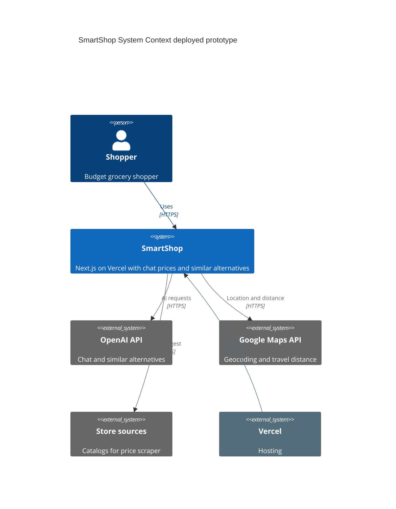

# Architecture Retrospective — SmartShop

**Date:** May 19, 2026  
**Team:** Divya Bengali, Shreeya Koritala, Caroline Tapia, Terry Chen

---
## Product Vision
#### FOR 
grocery shoppers
#### WHO 
want to save money/are on a budget.
#### THE 
Smart Shop app
#### THAT
Compares prices of groceries and ingredients across different grocery stores in the area and shows the user the most affordable option
#### UNLIKE 
Honey, the browser extension, that looks for online coupons. And unlike manually checking each store’s app/website (or just shopping at one store and hoping it’s cheapest).
#### OUR PRODUCT 
shows both prices and distance to the grocery store and helps users decide whether a lower price is actually worth the extra trip. Smart Shop automatically finds the lowest local price for the exact item you want across multiple stores so you don’t overpay for the same thing. Our product is POWERED BY AI that will read the text / images that the user inputs into the app and searches the web/ database to search for the most affordable options. It reduces the manual work of searching store by store and helps users compare equivalent products more accurately.

## C4 System Context Diagram

```mermaid
C4Context
  title SmartShop System Context deployed prototype

  Person(shopper, "Shopper", "Budget grocery shopper")

  System(smartshop, "SmartShop", "Next.js on Vercel with chat prices and similar alternatives")

  System_Ext(openai, "OpenAI API", "Chat and similar alternatives")
  System_Ext(maps, "Google Maps API", "Geocoding and travel distance")
  System_Ext(retailers, "Store sources", "Catalogs for price scraper")
  System_Ext(vercel, "Vercel", "Hosting")

  Rel(shopper, smartshop, "Uses", "HTTPS")
  Rel(smartshop, openai, "AI requests", "HTTPS")
  Rel(smartshop, maps, "Location and distance", "HTTPS")
  Rel(smartshop, retailers, "Price ingest", "HTTPS")
  Rel(vercel, smartshop, "Deploys", "HTTPS")

  UpdateElementStyle(shopper, $bgColor="#08427B", $fontColor="#FFFFFF", $borderColor="#052E56")
  UpdateElementStyle(smartshop, $bgColor="#1168BD", $fontColor="#FFFFFF", $borderColor="#0B4884")
  UpdateElementStyle(openai, $bgColor="#686868", $fontColor="#FFFFFF", $borderColor="#444444")
  UpdateElementStyle(maps, $bgColor="#686868", $fontColor="#FFFFFF", $borderColor="#444444")
  UpdateElementStyle(retailers, $bgColor="#686868", $fontColor="#FFFFFF", $borderColor="#444444")
  UpdateElementStyle(vercel, $bgColor="#546E7A", $fontColor="#FFFFFF", $borderColor="#37474F")
  UpdateRelStyle(shopper, smartshop, $lineColor="#08427B", $textColor="#08427B")
  UpdateRelStyle(smartshop, openai, $lineColor="#686868", $textColor="#686868")
  UpdateRelStyle(smartshop, maps, $lineColor="#686868", $textColor="#686868")
  UpdateRelStyle(smartshop, retailers, $lineColor="#686868", $textColor="#686868")
  UpdateRelStyle(vercel, smartshop, $lineColor="#546E7A", $textColor="#546E7A")
  UpdateLayoutConfig($c4ShapeInRow="3", $c4BoundaryInRow="1")
```

Colors align with the [container diagram PDF](./architecture-retrospective.pdf) legend: **Person** (navy), **verified container** (blue), **external service** (gray), **infrastructure** (slate).

The full C4 container diagram, external services table, security notes, and CI coverage gap are documented in the PDF below.

[View architecture-retrospective.pdf](https://github.com/CSEN-SCU/csen-174-s26-team-project-smartshop/blob/main/docs/architecture-retrospective.pdf)
