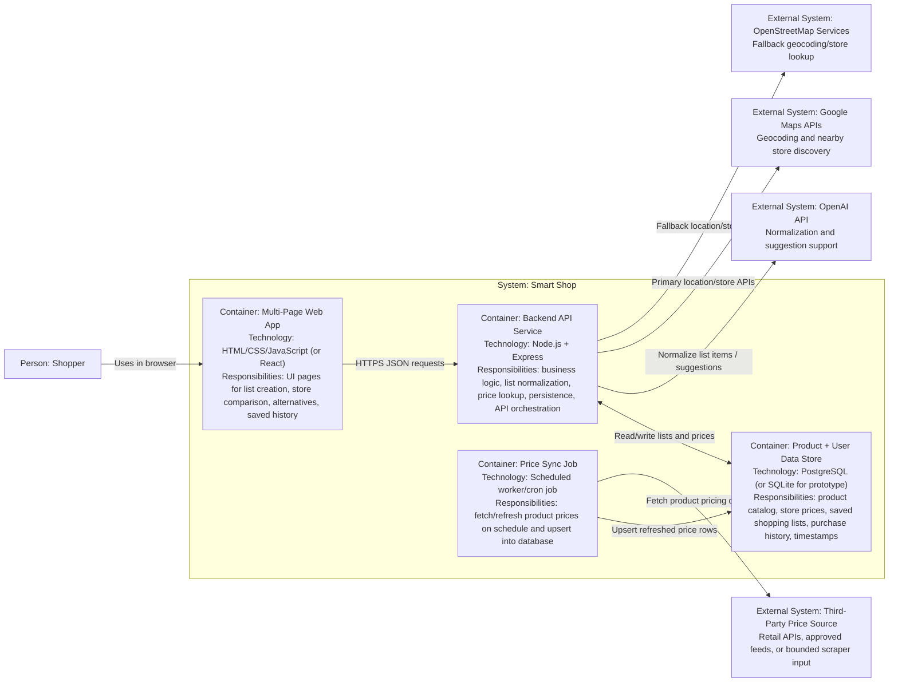

# Smart Shop Prototype - C4 Container Diagram (Level 2)

This diagram decomposes `Smart Shop` into deployable/runtime containers and shows how data flows between them.

## Container Notes

- `Multi-Page Web App` is intentionally split into multiple user journeys (e.g., compare prices, saved lists, alternatives) while staying a single frontend container.
- `Backend API Service` is the only container allowed to access external APIs and the database directly.
- `Product + User Data Store` is the source of truth for prices and saved lists; backend both reads and writes.
- `Price Sync Job` keeps price data fresh (hourly/daily) without tying refresh to user requests.

## Recommended Data Ownership

- `web`: presentation state only.
- `api`: validation, normalization, matching, and response shaping.
- `db`: durable records for `items`, `stores`, `price_observations`, `shopping_lists`, and `list_items`.
- `sync`: ingestion pipeline with timestamps (`observed_at`, `updated_at`) and retry logging.
