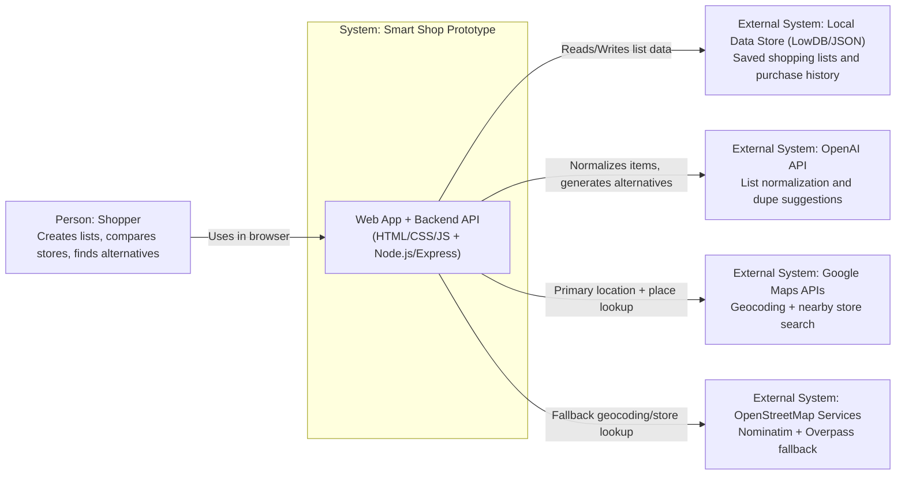

# Smart Shop Prototype - C4 System Context (Level 1)

This diagram shows `Smart Shop Prototype` as a single system and the people/systems it interacts with.

## Scope Notes

- **System of interest:** `Smart Shop Prototype` (frontend + backend API in one deployable unit).
- **Primary actor:** `Shopper`.
- **Current persistence:** `LowDB` JSON file (prototype stage).
- **Pricing behavior today:** mix of mock catalog pricing and estimated values for discovered stores.
- **Likely production evolution:** replace `LowDB` with `SQLite` or `PostgreSQL`, and add a scheduled price-ingestion pipeline.
